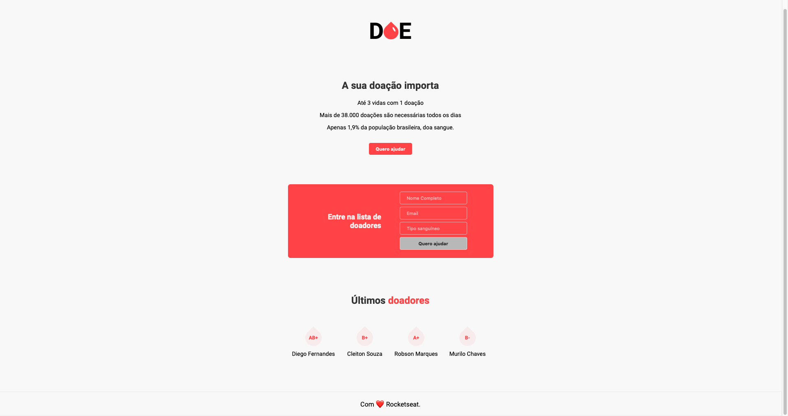

<h1 align="center">
	
</h1>

<h3 align="center">
	Um sistema minimalista para cadastrar doadores de sangue.
</h3>

	Projeto <b>DOE Sangue</b> desenvolvido durante a 3ª ed. da MaratonaDev da Rocketseat 🎓

	
	</img>
	
	</img>
	
	</img>

	<a href="#rocket-instalação">Instalação</a>&nbsp;&nbsp;&nbsp;|&nbsp;&nbsp;&nbsp;
	<a href="#memo-licença">Licença</a>

## :rocket: Instalação

1. Faça a instalação do editor de código [VS Code](https://code.visualstudio.com);
2. Utilize o [Google Chrome](https://www.google.com/intl/pt-BR/chrome/) com as ferramentas de inspeção de código web.

### Tecnologias

* `HTML` (estrutura);
* `CSS` (estilo);
* `JavaScript` (inteligência).

### Apresentação

	Você sabia que uma simples doação de sangue pode salvar até 3 vidas?
	  
	No cenário brasileiro, a doação de sangue não se é uma prática tão corriqueira, apesar de sempre estarmos cientes que a doação de sangue é importante e, vermos várias campanhas, apenas <b>1.9</b>% da população brasileira realiza a doação de sangue constantemente. Todos os dias são necessárias mais de <b>38.000</b> doações para que atenda a demanda dos hemocentros. Sendo assim, este projeto visa proporcionar o alcançe à mais pessoas por ser disponível na web e, maior facilidade para encontrar os tipos sanguíneos podendo entrar em contato com a pessoa via e-mail quando necessitar de doações de um determinado tipo.
	  
	<b>P.S.</b>: <i>Esta aplicação foi criada à partir da 3ª MaratonaDev disponibilizada pela Rocketseat, um evento on-line ministrado por <a href="https://github.com/maykbrito">Mayk Brito</a> entre os dias 17/02/2020 à 19/02/2020</i>.

### Interface

<h1 align="center">
	
</h1>

### Extensões

* `Live Server`: Ritwick Dey - permite atualização automática da conteúdo da página `HTML`.

### Sites

* [CSS-Tricks](https://css-tricks.com);
* [Google Fonts](https://fonts.google.com/);
* [Imgur](https://imgur.com/).

## :memo: Licença

Esse projeto está sob a licença MIT. Veja o arquivo [LICENSE](LICENSE.md) para mais detalhes.